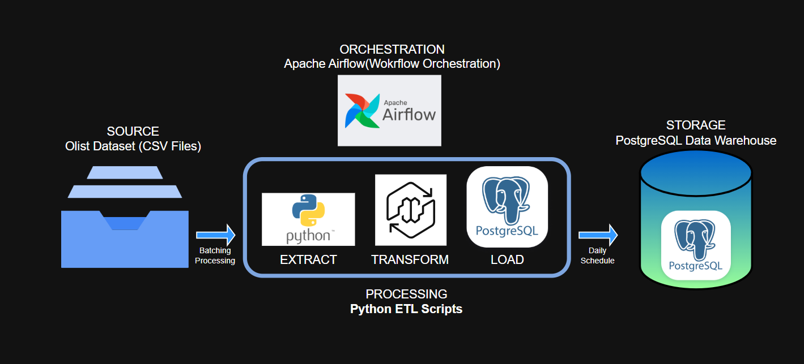
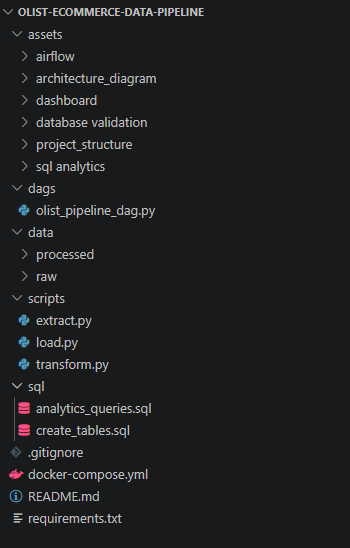
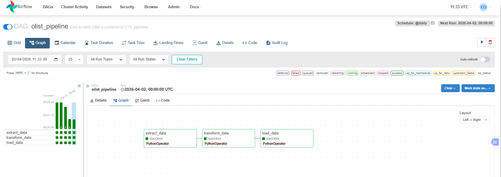
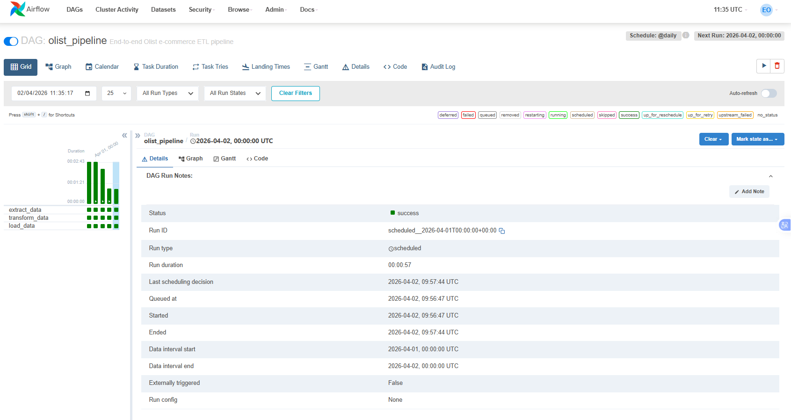
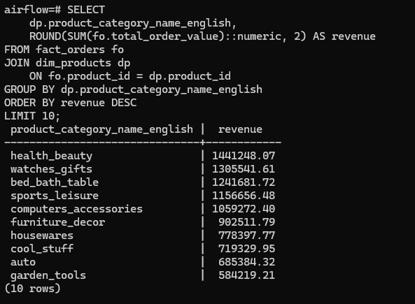
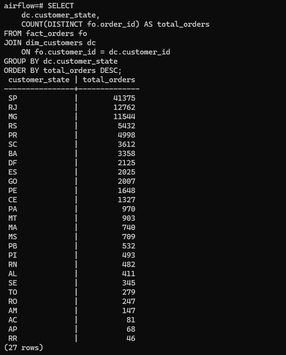
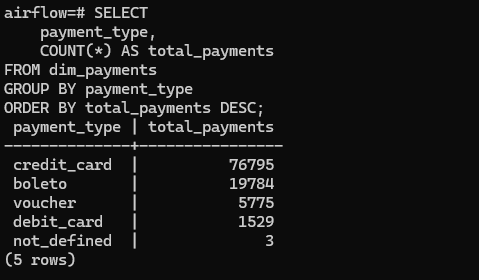
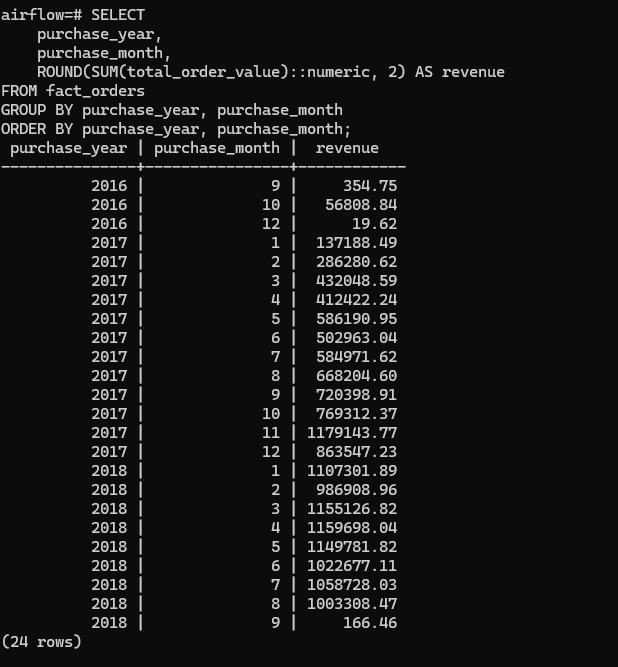
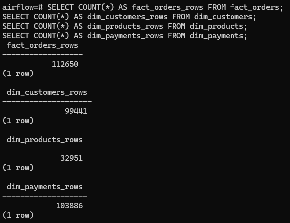
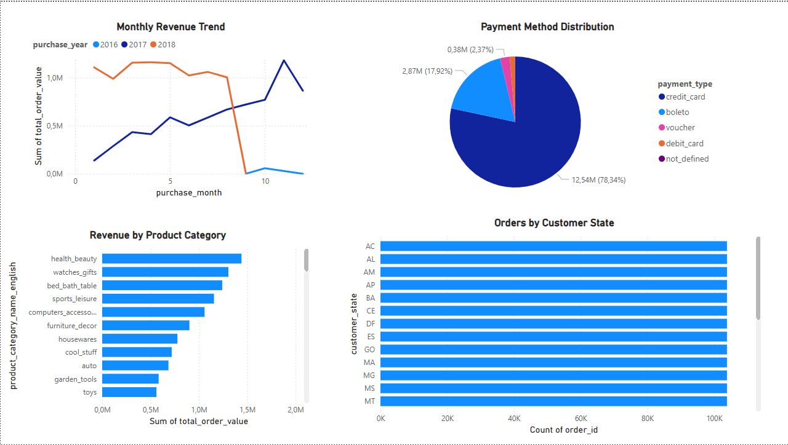

# Olist E-commerce Data Pipeline with Airflow & PostgreSQL

## 📌 Overview

This project demonstrates an **end-to-end data engineering pipeline** built using the **Olist Brazilian E-commerce dataset**.

The pipeline:

* Extracts raw CSV data
* Transforms it into analytics-ready tables
* Loads it into a PostgreSQL data warehouse
* Orchestrates the workflow using Apache Airflow

Additionally, a dashboard was created to visualize key business metrics such as revenue trends, customer distribution, and payment behavior.

---

## 🏗️ Architecture



### 🔹 Pipeline Flow

Olist CSV Files → Python ETL → PostgreSQL → Airflow → SQL Analytics → Dashboard

---

## ⚙️ Tech Stack

* Python (Pandas)
* PostgreSQL
* Apache Airflow
* Docker & Docker Compose
* SQL
* Power BI

---

## 📂 Project Structure



```bash
olist-ecommerce-data-pipeline/
│
├── dags/
│   └── olist_pipeline_dag.py
├── scripts/
│   ├── extract.py
│   ├── transform.py
│   └── load.py
├── sql/
│   ├── create_tables.sql
│   └── analytics_queries.sql
├── data/
│   ├── raw/
│   └── processed/
├── assets/
│   ├── airflow/
│   ├── architecture_diagram/
│   ├── dashboard/
│   ├── database_validation/
│   ├── project_structure/
│   └── sql_analytics/
├── docker-compose.yml
├── requirements.txt
└── README.md
```

---

## 🔄 ETL Pipeline





### Steps:

1. **Extract** → Load raw Olist CSV files
2. **Transform** → Clean data, join tables, create metrics
3. **Load** → Store processed data into PostgreSQL
4. **Orchestrate** → Automate workflow using Airflow

---

## 🗄️ Data Model

### Fact Table

* `fact_orders`

### Dimension Tables

* `dim_customers`
* `dim_products`
* `dim_payments`

---

## 📊 SQL Analytics

### Revenue by Product Category



### Orders by Customer State



### Payment Method Distribution



### Monthly Revenue Trend



### Database Validation



---

## 📈 Dashboard



The dashboard includes:

* Revenue by product category
* Orders by customer state
* Monthly revenue trends
* Payment method distribution

---

## ▶️ How to Run

### 1. Clone the repository

```bash
git clone https://github.com/ernest-oppong/olist-ecommerce-data-pipeline.git
cd olist-ecommerce-data-pipeline
```

### 2. Add dataset

Download the dataset and place CSV files into:

```bash
data/raw/
```

### 3. Start services

```bash
docker compose up
```

### 4. Open Airflow

http://localhost:8080

Login:

* Username: airflow
* Password: airflow

### 5. Run pipeline

* Activate DAG: `olist_pipeline`
* Trigger run

---

## 💡 Skills Demonstrated

* ETL pipeline development
* Data transformation and cleaning
* Data warehouse design (fact & dimension tables)
* Workflow orchestration with Apache Airflow
* SQL analytics for business insights
* Dashboard creation with Power BI
* Docker-based environment setup

---

## 🚀 Future Improvements

* Add real-time streaming (Kafka + Spark)
* Implement dbt transformations
* Add data quality checks
* Deploy to cloud (AWS / Azure / GCP)

---

## 👤 Author

**Ernest Oppong**

---

## ⭐ Final Note

This project demonstrates a complete **end-to-end data pipeline**, combining data engineering, analytics, and visualization — similar to real-world production systems.
